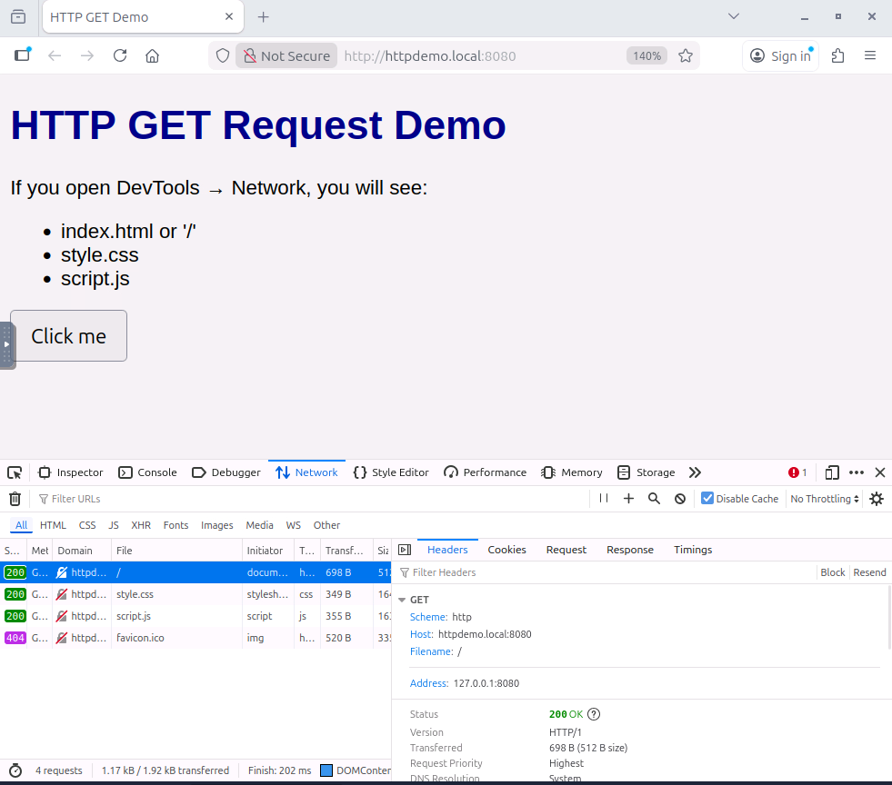
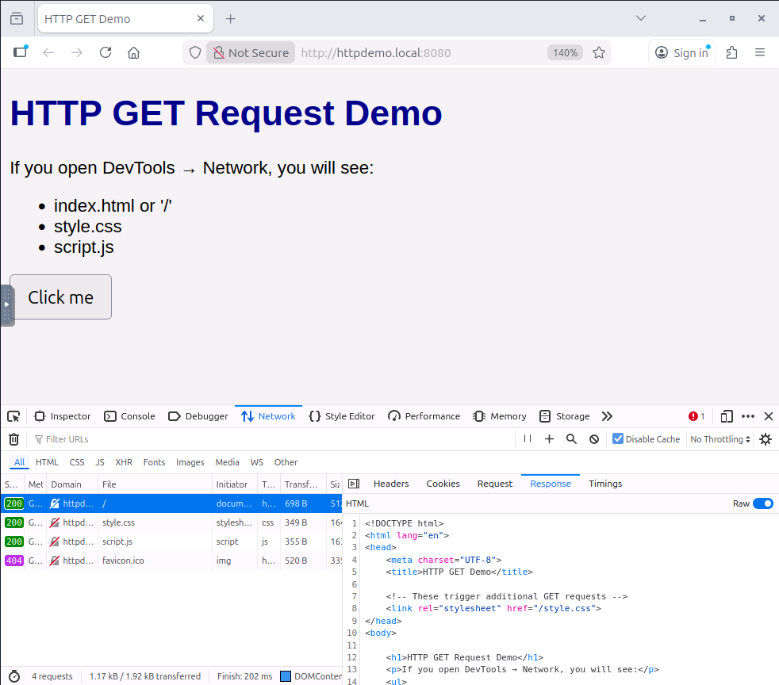

# Client-Server Basics

Path: Pre Security Module: Computer Fundamentals Category (skill focus): General Difficulty: Easy Room Link: https://tryhackme.com/room/clientserverbasics Date Completed: 20 September 2026

Skills Demonstrated: Client-server communication, HTTP fundamentals, GET requests, network traffic inspection, browser Developer Tools

## Overview

A beginner room introducing the Client-Server model and basic web communication. The room covers how interconnected systems communicate and how concepts such as clients, servers, ports, protocols, networks, and DNS are used to provide and access services.

The practical section provided hands-on experience inspecting HTTP requests and responses using a browser and Developer Tools.

## Tools Used

- Browser (Firefox)
- Firefox Developer Tools
- Network panel
- TryHackMe Lab Machine

## Approach

1. Introduction (Task 1): Learned the fundamentals of the Client-Server model and how interconnected computer systems communicate to provide and access services. The task introduced concepts including clients, servers, ports, protocols, networks, and DNS.

2. Web Communication in Practice (Task 3): Started the TryHackMe Lab Machine and opened the provided HTTP demonstration website in Firefox. Opened Firefox Developer Tools and navigated to the Network panel to observe the HTTP requests generated by the browser when loading the webpage.

3. Inspecting the HTTP GET Request (Task 3): Selected the main `GET /` request and inspected its headers. The request showed the HTTP method, scheme, host, filename, server address, HTTP version, and status code.

4. Inspecting the HTTP Response (Task 3): Opened the Response tab and examined the HTML content returned by the web server.

5. Identifying URL Components (Task 3): Practiced identifying the host and scheme from a URL. For `https://www.iamlearning.thm/contact`, the host is `www.iamlearning.thm` and the scheme is `https`.

## Result

Successfully practiced the fundamentals of client-server communication and inspected an actual HTTP request and response using Firefox Developer Tools.

The main `GET /` request used the `http` scheme and `httpdemo.local:8080` as the host. The request returned a `200 OK` status, and the response body contained the HTML returned by the web server.

## Key Takeaways

This room introduced the fundamentals of how clients and servers communicate over a network. I learned the roles of clients, servers, ports, protocols, networks, and DNS within the Client-Server model.

The practical HTTP exercise gave me hands-on experience using the Network panel in Firefox Developer Tools to inspect requests and responses. I was able to identify the HTTP method, scheme, host, requested path, server address, HTTP version, and status code, as well as inspect the HTML returned by the server.

---

Flags are censored in accordance with TryHackMe's policy. Completed as part of my hands-on cybersecurity practice.
