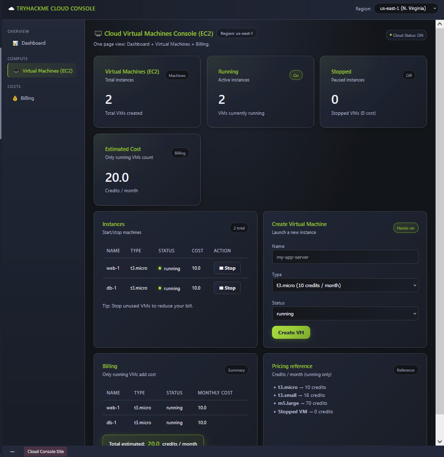
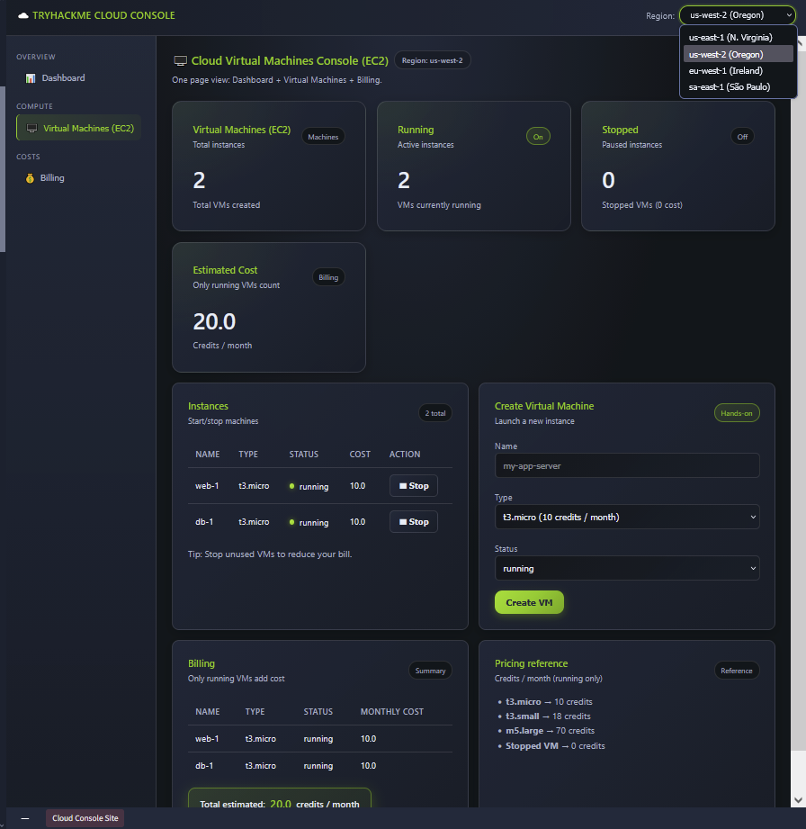
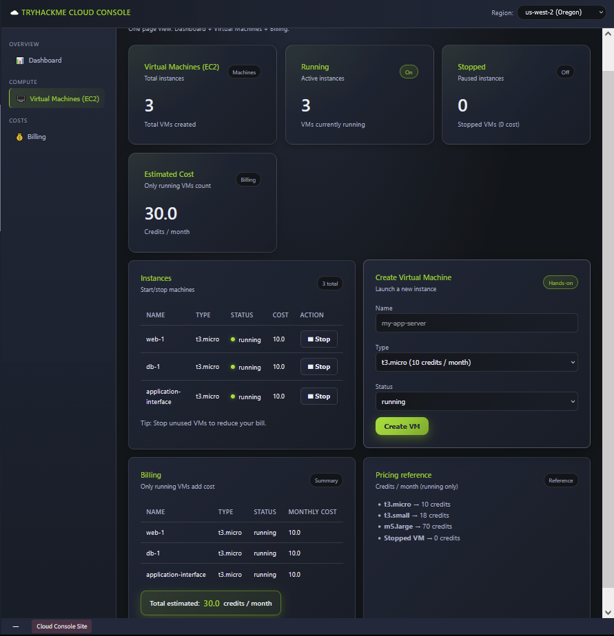
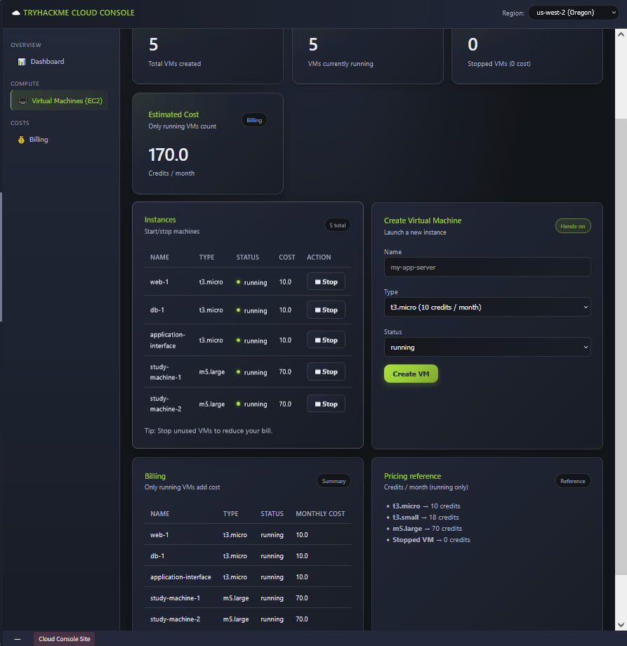
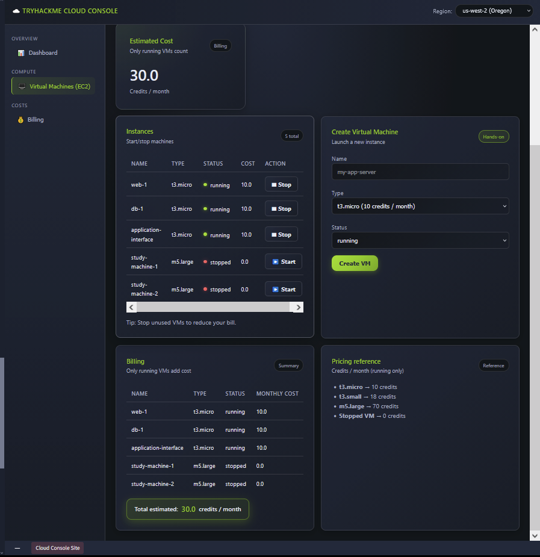

# Cloud Computing Fundamentals

**Path:** Pre Security  
**Module:** Computer Fundamentals  
**Category (skill focus):** Infrastructure / Cloud Computing  
**Difficulty:** Easy  
**Room Link:** https://tryhackme.com/room/cloudcomputingfundamentals  
**Date Completed:** 21 September 2026

**Skills Demonstrated:** Cloud resource management, EC2 instance deployment, cloud regions, instance types, VM lifecycle management, cost optimization

## Overview

A beginner room introducing the fundamentals of cloud computing and how organizations use cloud infrastructure to deploy and scale applications. The practical task simulated an AWS-style cloud environment where I created and managed virtual machines (EC2 instances), selected a deployment region, and observed how instance types and running states affected the estimated monthly cost.

## Tools Used

- TryHackMe Cloud Console
- Cloud Virtual Machines Console (EC2)
- Virtual Machines dashboard
- Billing dashboard

## Approach

1. **Review the Initial Environment (Task 3):** Opened the Cloud Virtual Machines Console and reviewed the starting environment. The console was initially set to **us-east-1 (N. Virginia)** and contained two running instances: `web-1` and `db-1`. Both used the `t3.micro` instance type and cost 10 credits/month each, giving an estimated total of **20 credits/month**.

   

2. **Pick a Region (Task 3):** Opened the **Region** selector and reviewed the available cloud regions. I selected **us-west-2 (Oregon)** as the region for the lab environment.

   

3. **Create the Application Interface Machine (Task 3):** Used the **Create Virtual Machine** section to create an instance named `application-interface`. The instance was configured as a `t3.micro` with a **running** status. This increased the environment from 2 to 3 instances and raised the estimated cost to **30 credits/month**.

   

4. **Create the Study Machines (Task 3):** Created two testing machines for practicing cybersecurity skills:
   - `study-machine-1` → `m5.large` → running → **70 credits/month**
   - `study-machine-2` → `m5.large` → running → **70 credits/month**

   After creating both machines, the environment contained **5 running instances** and the estimated monthly cost increased to **170 credits/month**.

   

5. **Stop Unused Study Machines (Task 3):** Since the study machines were not currently needed, I stopped both `study-machine-1` and `study-machine-2`. Their running cost became **0 credits/month**, while the other three instances remained running. The estimated monthly cost decreased from **170 to 30 credits/month**.

   

6. **Complete the Task Questions:** Used the pricing and instance information from the console to answer the task questions:
   - Total cost when `study-machine-1` and `study-machine-2` are stopped: **30 credits/month**
   - Cost of an `m5.large` EC2 instance: **70 credits/month**
   - Total cost when only the two newly created study machines are running: **150 credits/month**
   - Total running cost after adding a third `t3a.small` study machine: **188 credits/month**

## Result

Successfully deployed and managed a simulated cloud environment by selecting a region, creating an application interface instance and two study machines, and controlling instance states to reduce running costs. The task demonstrated how cloud resources can be provisioned on demand and how stopping unused instances can significantly reduce the estimated cost.

## Key Takeaways

This room introduced me to the operational side of cloud computing through an AWS-style EC2 environment. I practiced the basic workflow of selecting a region, provisioning compute resources, choosing an instance type, and managing the running state of virtual machines.

The billing exercise also showed the relationship between **instance type, running state, and cost**. Larger instances such as `m5.large` consume more credits than `t3.micro`, while stopped instances no longer contribute to the running cost in this simulation. This is an important concept for both cloud operations and security environments where temporary lab resources may need to be created and stopped as required.

---

*Completed as part of my hands-on cybersecurity and IT infrastructure learning. Screenshots document the TryHackMe lab environment and focus on the methodology and concepts practiced.*
