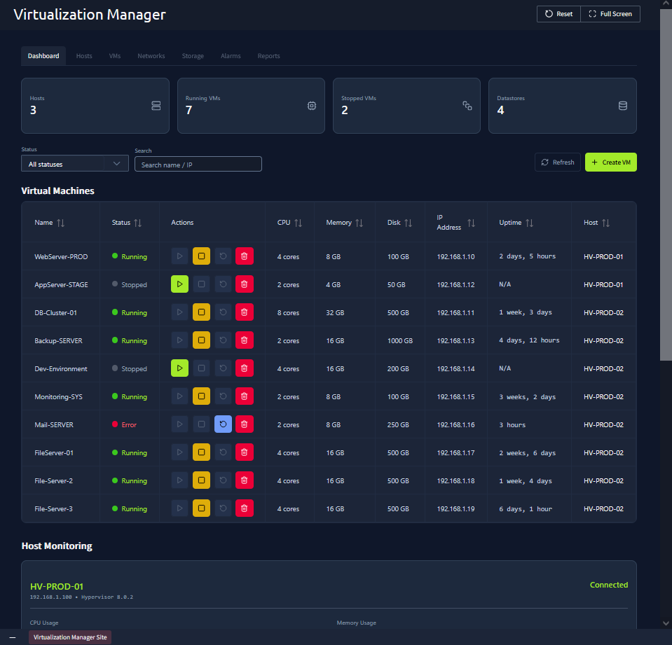
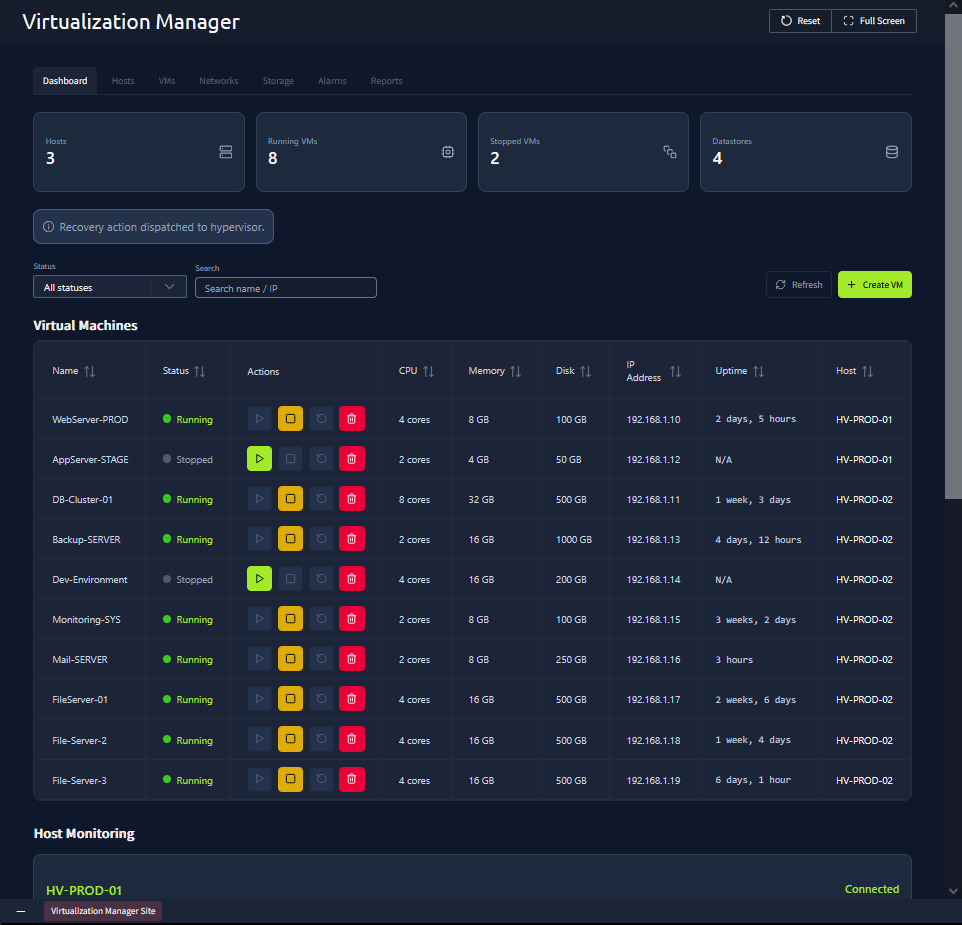
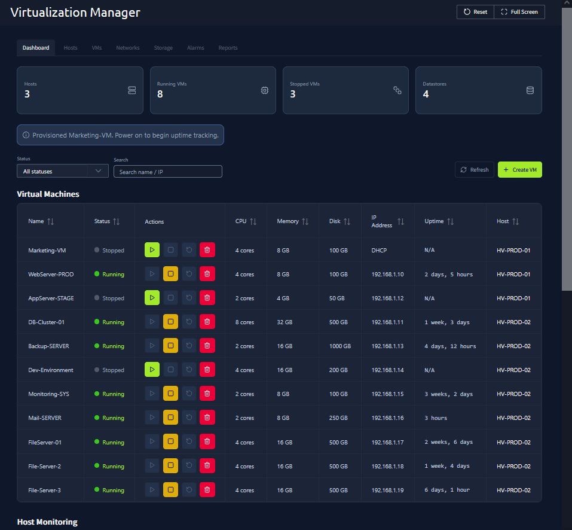
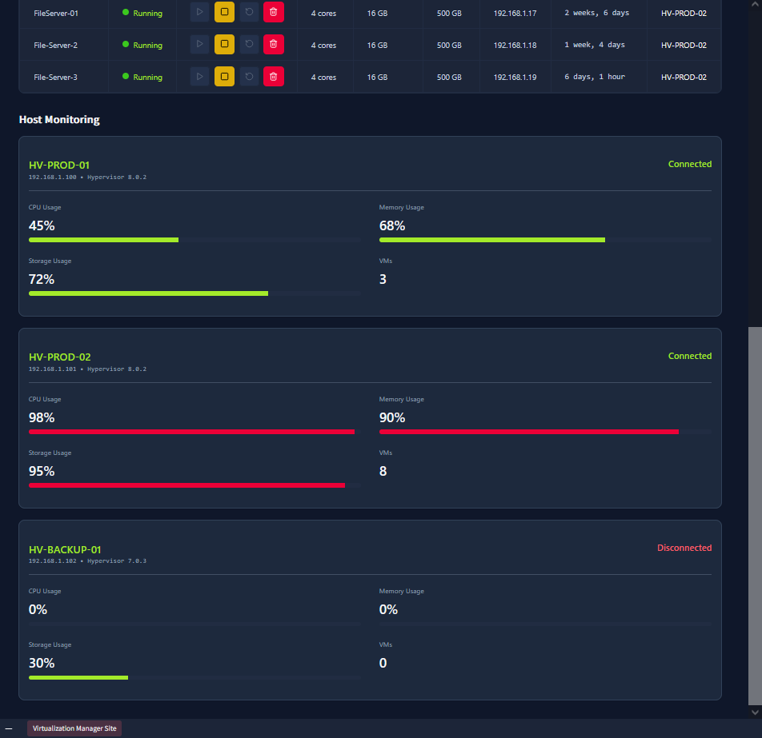

# Virtualisation Basics

**Path:** Pre Security  
**Module:** Computer Fundamentals  
**Category (skill focus):** Infrastructure / Virtualization  
**Difficulty:** Easy  
**Room Link:** https://tryhackme.com/room/virtualisationbasics  
**Date Completed:** 21 September 2026

**Skills Demonstrated:** Virtual machine management, VM recovery, resource allocation, hypervisor monitoring, hardware utilization analysis

## Overview

A beginner room introducing virtualization and how virtual machines can be managed through a centralized virtualization manager. The practical task involved troubleshooting a VM, provisioning a new virtual machine, and reviewing the hardware resources and availability of physical hypervisor hosts.

## Tools Used

- Virtualization Manager
- Virtual Machines dashboard
- Host Monitoring dashboard
- TryHackMe Lab Environment

## Approach

1. **Analyze the Initial VM State (Task 4):** Opened the Virtualization Manager and reviewed the current environment. The dashboard showed 3 hosts, 7 running VMs, and 2 stopped VMs. The `Mail-SERVER` VM was in an **Error** state.

   

2. **Recover the Mail Server (Task 4):** Located `Mail-SERVER` in the Lab Machines section and used the recovery/restart action. After the recovery action was completed, the VM returned to a **Running** state and the number of running VMs increased from 7 to 8.

   

3. **Create a New Lab Machine (Task 4):** Opened the **Create VM** form and provisioned a new VM named `Marketing-VM` using 4 CPU cores, 8 GB of memory, and 100 GB of disk space. The VM was successfully created and appeared in the VM list with a **Stopped** status.

   

4. **Analyze Host Hardware Usage (Task 4):** Reviewed the Host Monitoring section to understand resource utilization across the physical hypervisor hosts. `HV-PROD-01` was connected with moderate resource usage, `HV-PROD-02` was operating close to capacity, and `HV-BACKUP-01` was disconnected and was not hosting any VMs.

   

5. **Complete the Task Questions:** Verified the VM and host information needed to complete the task:
   - Longest-running VM: `Monitoring-SYS`
   - VM using the most memory: `DB-Cluster-01`
   - Running VMs after recovering `Mail-SERVER`: **8**
   - Physical host running most of the VMs: `HV-PROD-02`

## Result

Successfully managed a simulated virtualization environment by identifying and recovering a VM in an error state, provisioning a new virtual machine with specified hardware resources, and analyzing the utilization and availability of physical hypervisor hosts.

## Key Takeaways

This room provided hands-on practice with the operational side of virtualization management. I learned how to check VM health, recover a failed VM, allocate CPU, memory, and disk resources when provisioning a new VM, and interpret host-level utilization data.

The monitoring exercise also showed the importance of tracking resource utilization in a virtualized environment. Hosts operating close to CPU, memory, or storage capacity have less room for additional workloads, while a disconnected host cannot currently provide compute resources.

---

*Completed as part of my hands-on cybersecurity and IT infrastructure learning. Screenshots document the TryHackMe lab environment and focus on the methodology and concepts practiced.*
