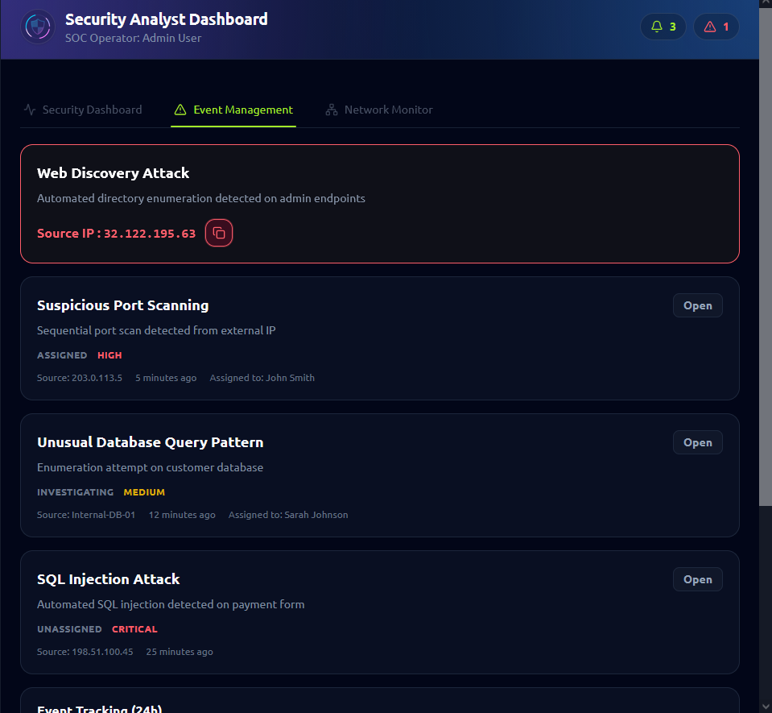
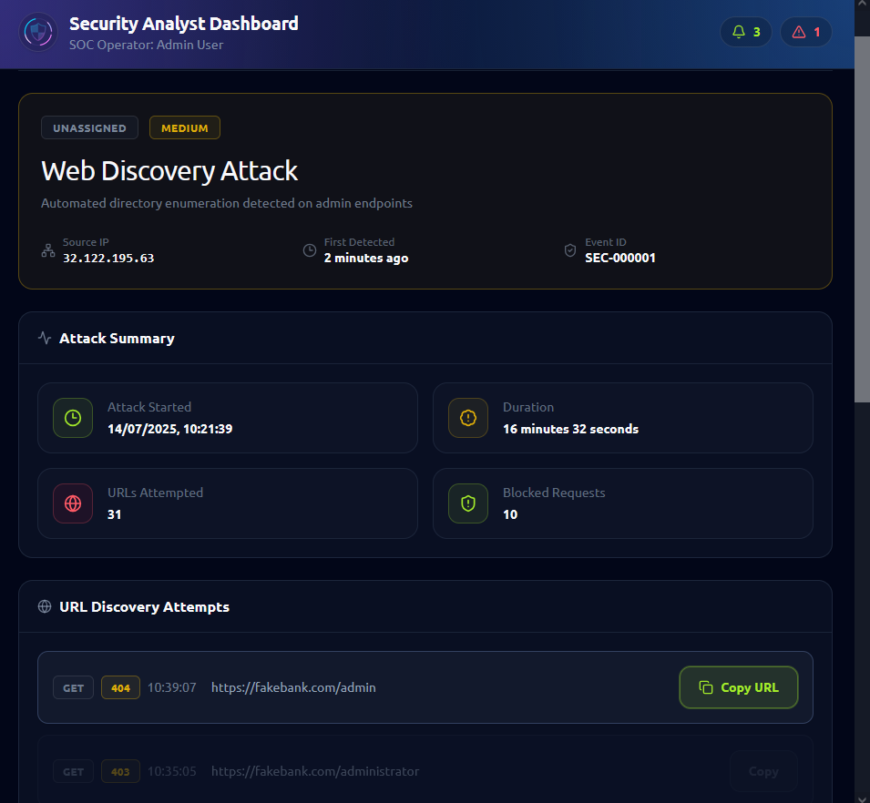
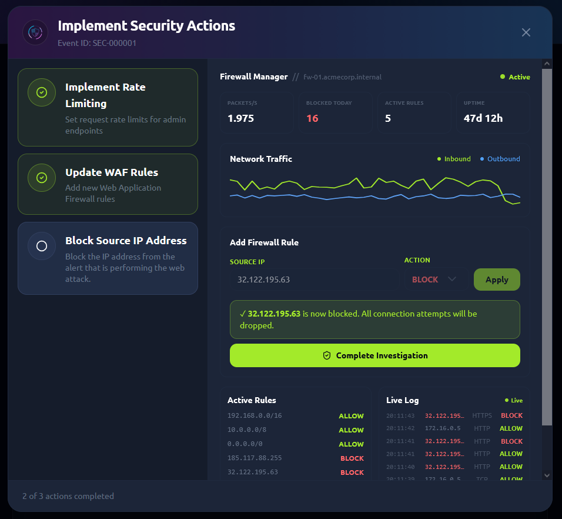

# Defensive Security Intro

**Path:** Pre Security
**Module:** Introduction to Cyber Security
**Category (skill focus):** Blue Team
**Difficulty:** Easy
**Room Link:** https://tryhackme.com/room/defensivesecurityintro
**Date Completed:** 17 September 2026

**Skills Demonstrated:** Security alert triage, log/URL investigation, incident containment, firewall rule configuration

## Overview
A beginner blue team room simulating a SOC analyst workflow — detecting suspicious
activity from security alerts, investigating the nature of an attack, and
responding by containing the threat.

## Tools Used
- Security Analyst Dashboard (alert monitoring)
- Firewall Manager

## Approach
1. **Think Like a Defender (Task 1):** Introduced the concept of defensive
   security — monitoring and protecting systems, focused on detecting and
   investigating attacks and responding before damage occurs, as opposed to
   offensive security which involves actively attacking systems to find flaws.
   Set the mindset for the rest of the room: approach the scenario as a defender
   watching over a system, not an attacker probing one.
2. **Detect Suspicious Activity (Task 2):** Opened the Security Analyst Dashboard
   and reviewed recent security alerts. Investigated an alert flagged as a Web
   Discovery Attack and identified the source IP generating the suspicious traffic
   (`32.122.195.63`). The alert indicated automated directory enumeration against
   admin endpoints.

   
3. **Identify the Attack (Task 3):** Opened the Web Discovery Attack event and
   reviewed the list of URL discovery attempts to understand what the attacker
   was trying to access. The latest attempted URL was `https://fakebank.com/admin`,
   indicating the attacker was probing for an administrative endpoint.

   
4. **Stop the Attack (Task 4):** Reviewed available security actions and opened
   the Firewall Manager. Added the identified source IP (`32.122.195.63`) to a
   firewall rule with the action set to BLOCK, then applied the rule. Verified
   in the live log that subsequent connection attempts from that IP were blocked.

   

## Result
Successfully detected, investigated, and contained a simulated web discovery
attack: identified the malicious source IP from a security alert, traced the
attacker's target (an admin endpoint), and blocked further access via a
firewall rule — confirmed effective in the live traffic log.

## Key Takeaways
This room gave me a first hands-on look at the core SOC analyst workflow: detect,
investigate, respond. Reviewing the alert dashboard showed how raw traffic data
gets surfaced as something analysts can act on, and tracing the discovery attempts
made it clear how much you can infer about an attacker's intent just from the URLs
they're probing. Actually applying the firewall block and watching it take effect
in the live log made the "containment" step feel concrete rather than theoretical —
it's the kind of action a SOC analyst takes under real time pressure.

---
*Flags are censored in accordance with TryHackMe's policy. Completed as part of my hands-on cybersecurity practice.*
