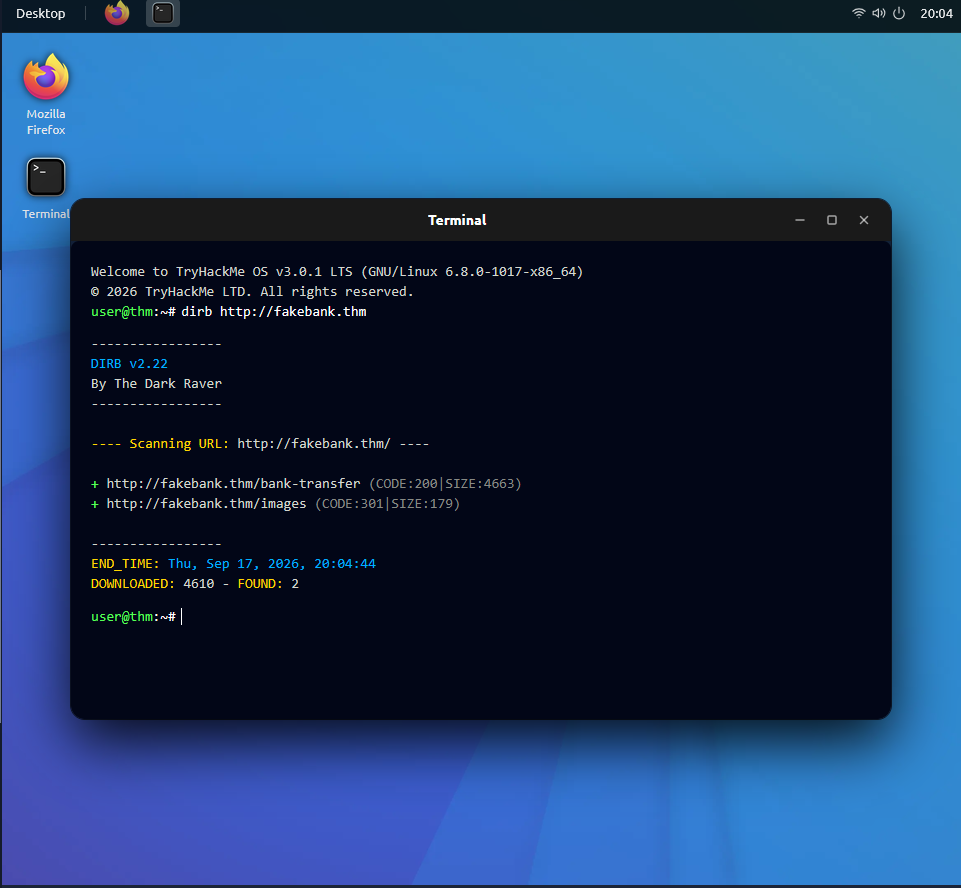

# Offensive Security Intro

**Path:** Pre Security
**Module:** Introduction to Cyber Security
**Category (skill focus):** Red Team
**Difficulty:** Easy
**Room Link:** https://tryhackme.com/room/offensivesecurityintro
**Date Completed:** 17 September 2026

**Skills Demonstrated:** Web reconnaissance, information gathering, directory
enumeration, identifying access control weaknesses

## Overview
A beginner room simulating a basic offensive security engagement against FakeBank,
a mock banking web application. The room walks through thinking like an attacker,
exploring a target, and finding hidden/unlisted content.

## Tools Used
- Browser (virtual desktop environment)
- DIRB — directory brute-forcing tool used to discover hidden pages

## Approach
1. **Think Like a Hacker (Task 1):** Introduced the concept of offensive security —
   simulating an attacker's actions to find weaknesses before real attackers do,
   as opposed to defensive security which focuses on protecting against attacks.
   Set the mindset for the rest of the room: approach the target the way an
   ethical hacker would.
2. **Starting the Lab (Task 2):** Started the virtual desktop environment and opened
   the FakeBank web application, the target for this room. Inspected the account
   page and identified exposed information, including the bank account number (8881)
   and recent transaction details.
3. **Find Hidden Pages (Task 3):** Opened the terminal and ran DIRB against the
   target (`dirb http://fakebank.thm`) to brute-force common directory and file
   names not linked from the main site. DIRB returned two discovered paths:
   `/images` and `/bank-transfer`. The `/bank-transfer` page was the hidden page
   not accessible through normal site navigation.

   
4. **Attack the Admin Page (Task 4):** Navigated to the hidden `/bank-transfer`
   page found in Task 3. The page turned out to be an unauthenticated admin portal
   allowing deposits to any account. Selected account 8881 and deposited $2000,
   then confirmed the account balance changed from negative to positive —
   demonstrating that the hidden page had no access control protecting it.

## Result
Successfully completed all four tasks (100%). Identified exposed account information
on the target application, used DIRB to discover a hidden `/bank-transfer` page not
linked anywhere in the visible site navigation, and confirmed the page was an
unauthenticated admin portal by using it to modify the account balance —
demonstrating a real access control weakness in the (simulated) application.

## Key Takeaways
This room introduced me to basic reconnaissance — inspecting a target application to
identify exposed information before deeper testing. Even small details like an account
number visible on a page can be useful data during a security assessment.

Using DIRB to brute-force hidden directories was my first hands-on experience with
a real reconnaissance tool rather than just reading about the concept — running one
command surfaced a page (`/bank-transfer`) that wasn't reachable through normal
browsing at all. It made clear why directory enumeration is a standard early step
in both offensive testing and defensive hardening: if a scanning tool can find it
in seconds, so can an attacker.

---
*Flags are censored in accordance with TryHackMe's policy. Completed as part of my hands-on cybersecurity practice.*
