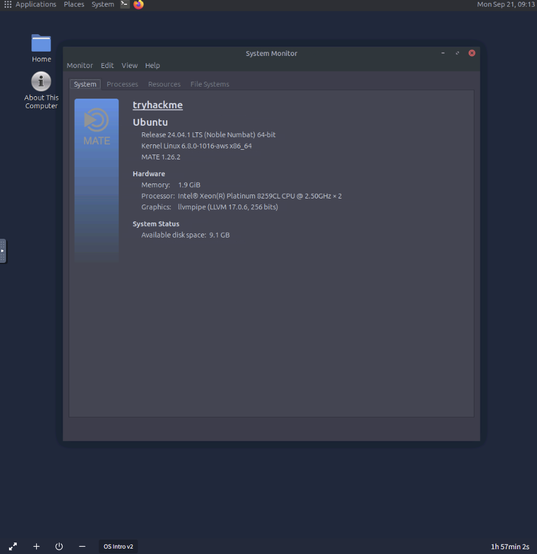
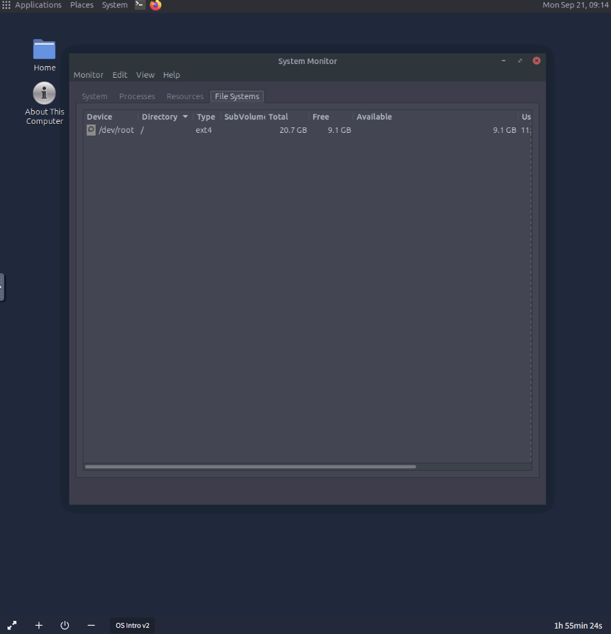
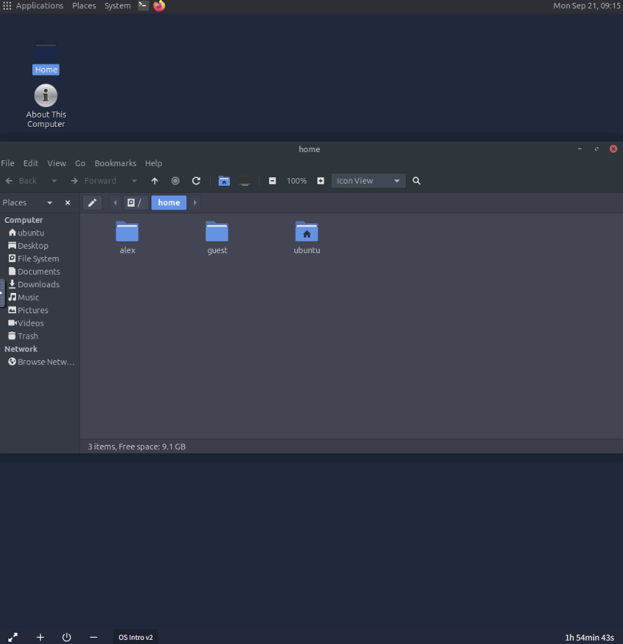
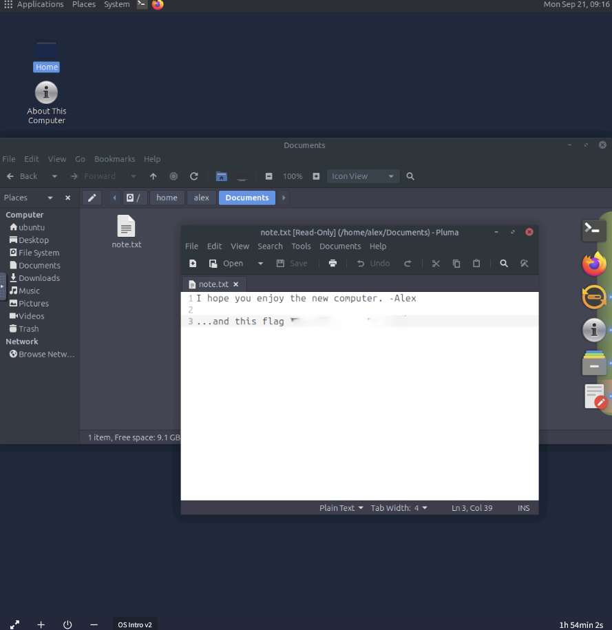

# Operating Systems: Introduction

**Path:** Pre Security  
**Module:** Operating Systems Basics  
**Category (skill focus):** Security Fundamentals  
**Difficulty:** Easy  
**Room Link:** https://tryhackme.com/room/operatingsystemsintroduction  
**Date Completed:** 21 September 2026

**Skills Demonstrated:** Operating system fundamentals, Linux system information gathering, filesystem exploration, GUI/CLI concepts, user management and permissions

## Overview

A beginner room introducing the fundamentals of operating systems and how they manage the interaction between users, applications, and computer hardware.

The room also provided hands-on practice in an Ubuntu MATE environment, including gathering system information, inspecting the filesystem, navigating user directories, and locating a file inside the Linux filesystem.

## Tools Used

- TryHackMe virtual lab
- Ubuntu MATE
- System Monitor
- File Manager
- Linux filesystem

## Approach

1. **The Invisible Manager (Task 2):** Learned how an operating system acts as the layer between users, applications, and hardware. Covered Kernel Space and User Space, along with core OS responsibilities such as process management, memory management, file system management, user management, and device management.

   Started the TryHackMe lab machine and used **System Monitor** to inspect the system information.

   

   The lab environment reported Ubuntu 24.04.1 LTS (64-bit), Linux kernel 6.8.0-1016-aws x86_64, MATE 1.26.2, and 1.9 GiB of memory.

2. **OS Interaction and Landscape (Task 3):** Learned the difference between a Graphical User Interface (GUI) and a Command-Line Interface (CLI), and reviewed common operating system types including desktop, server, mobile, embedded, and virtual/cloud environments.

   The practical exercise focused on exploring the Linux filesystem.

   First, I inspected the **File Systems** section in System Monitor and identified the filesystem type used by `/dev/root`.

   

   The filesystem was **ext4**.

   I then opened `/home` and identified the available user directories.

   

   The directory contained three user directories: `alex`, `guest`, and `ubuntu`.

   Finally, I navigated to `/home/alex/Documents/` and opened `note.txt` to complete the filesystem exploration task.

   

   The file contained the room flag. The flag is intentionally omitted from this write-up.

## Result

Successfully completed the room (100%). I learned the fundamental responsibilities of an operating system and practiced gathering system information and navigating a Linux filesystem in an Ubuntu MATE lab environment.

The practical work included:

- Identifying the Ubuntu MATE version and system information
- Identifying the filesystem type used by `/dev/root`
- Enumerating user directories under `/home`
- Navigating the Linux filesystem to locate a specific file

## Key Takeaways

This room established several important operating system concepts that are useful for cybersecurity:

- The **OS** manages hardware, applications, users, and system resources.
- **Kernel Space** contains highly privileged OS functionality with direct access to system resources.
- **User Space** provides a restricted environment for regular applications.
- OS responsibilities include **process, memory, filesystem, user, and device management**.
- **GUI** and **CLI** are two different ways to interact with an operating system.
- Linux filesystems such as **ext4** organize and store system data.
- User home directories are commonly organized under **/home**.
- System information can be gathered using built-in operating system tools.

## Cybersecurity Relevance

Understanding operating systems is a fundamental requirement for defensive security work.

Security analysts may need to investigate:

- Running processes
- User accounts and permissions
- Files and directories
- System configuration
- System information
- Suspicious activity at the operating system level

These concepts provide a foundation for later Blue Team and SOC topics such as Linux investigation, log analysis, endpoint monitoring, incident response, and security tooling.

---

*Flags are intentionally omitted from this write-up. Completed as part of my hands-on cybersecurity practice.*
