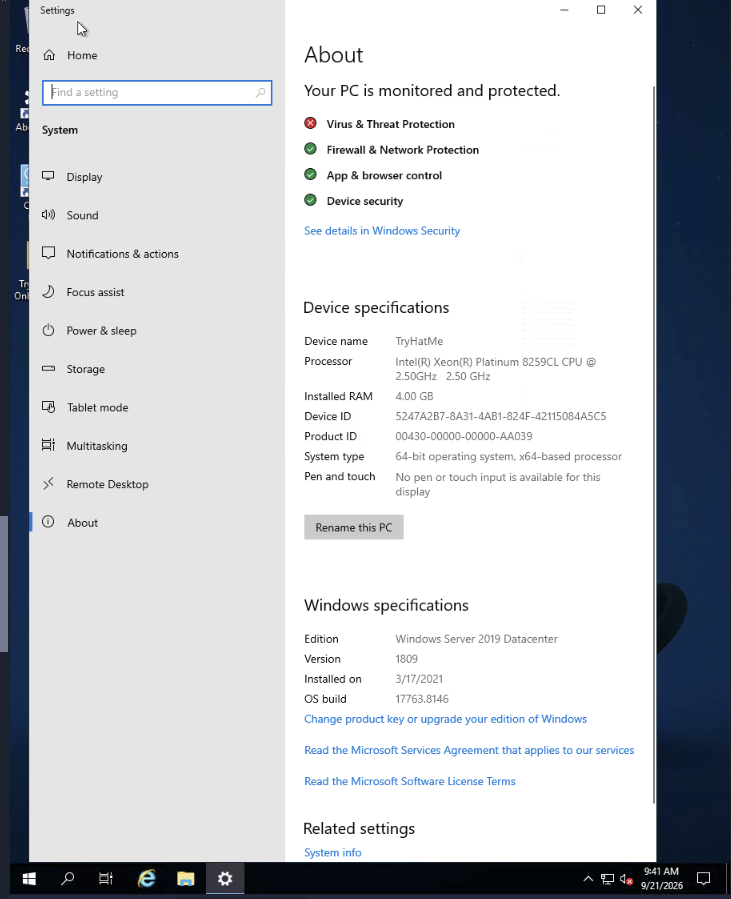
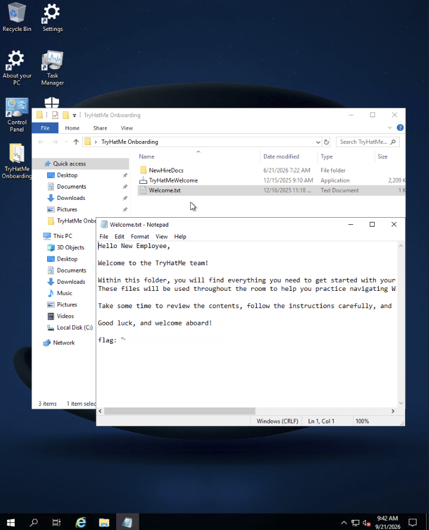
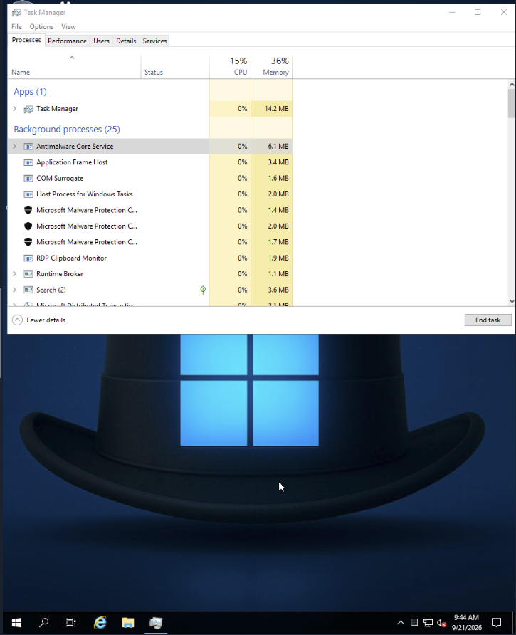
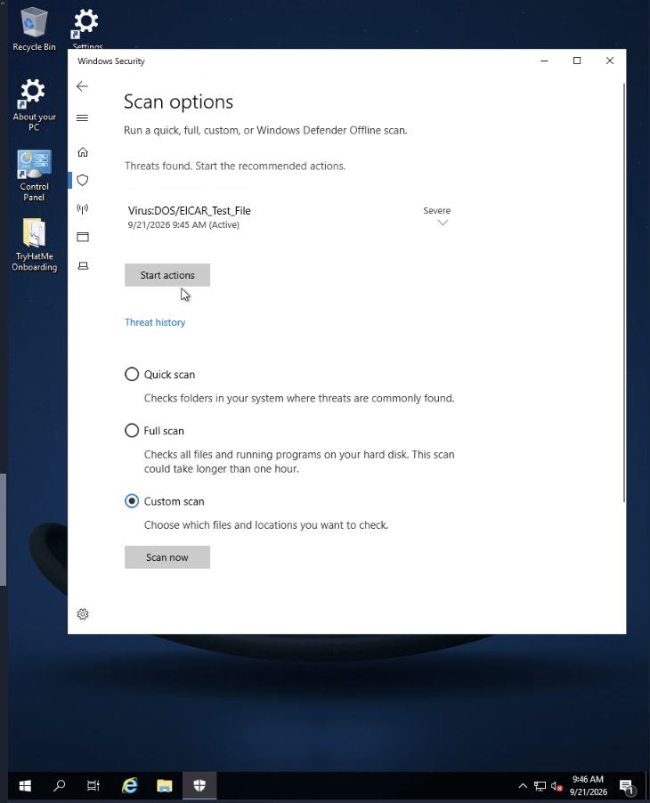
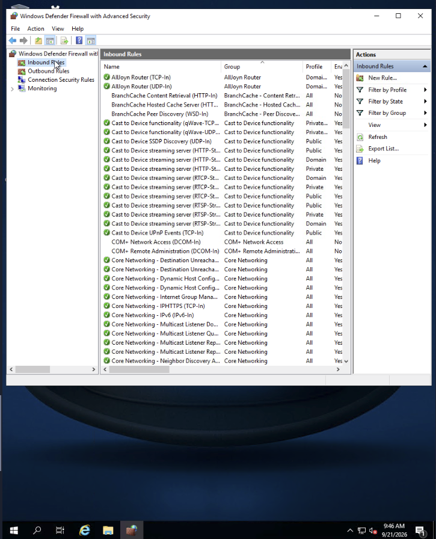

# Windows Basics

**Path:** Pre Security  
**Module:** Operating Systems Basics  
**Category (skill focus):** Security Fundamentals  
**Difficulty:** Easy  
**Room Link:** https://tryhackme.com/room/windowsbasics  
**Date Completed:** 21 September 2026

**Skills Demonstrated:** Windows desktop navigation, system information gathering, Windows filesystem exploration, application management, Task Manager, Windows Security, Microsoft Defender, Windows Defender Firewall

## Overview

A beginner room introducing the fundamentals of the Windows operating system through a hands-on Windows Server 2019 environment.

The room covered Windows desktop navigation, user accounts, system information, file and application management, system monitoring, and built-in security controls. The practical exercises provided an introduction to tools that are relevant to Windows administration and defensive security.

## Tools Used

- TryHackMe virtual lab
- Windows Server 2019
- Windows Settings
- File Explorer
- Task Manager
- Windows Security
- Microsoft Defender
- Windows Defender Firewall

## Approach

1. **Exploring the Windows Workspace (Task 2):** Learned the main components of the Windows graphical interface, including the Desktop, Taskbar, Start Menu, File Explorer, and system settings.

   I then inspected **About your PC** to gather system information from the lab environment.

   

   The lab environment reported:
   - Device name: `TryHatMe`
   - Installed RAM: 4.00 GB
   - Windows edition: Windows Server 2019 Datacenter
   - Version: 1809

   I also used **File Explorer** to navigate the `TryHatMe Onboarding` folder and inspect its contents.

   

   The task demonstrated how Windows paths are structured and how File Explorer can be used to locate and manage files.

   The folder also contained a text file used by the room to provide a flag. The flag is intentionally omitted from this public write-up.

2. **Configuring and Securing Windows (Task 3):** Practiced basic Windows administration and security tasks, including application management, system configuration, process monitoring, malware scanning, and firewall inspection.

   Application management covered updating, installing, and uninstalling software through mechanisms such as Windows Update, Microsoft Store, Settings, Control Panel, and application installers.

   I then opened **Task Manager** to inspect running applications, background processes, resource usage, and logged-in users.

   

   Task Manager provides useful visibility into processes, CPU and memory usage, users, process details, and services.

   Next, I used **Windows Security** to perform a custom scan against the provided TryHackMe folder and reviewed the detected test file.

   

   This demonstrated how Microsoft Defender can detect a known test file and how Windows Security presents the result to the user.

   Finally, I inspected **Windows Defender Firewall with Advanced Security** and reviewed both inbound and outbound rules.

   

   The firewall interface provides visibility into network rules and helps control which connections are allowed or blocked.

## Result

Successfully completed the room (100%). I gained hands-on familiarity with the Windows desktop environment and several built-in administration and security tools.

The practical work included:

- Gathering Windows system information
- Navigating Windows folders and file paths
- Managing applications
- Monitoring processes and logged-in users
- Running a Microsoft Defender custom scan
- Inspecting Windows Defender Firewall rules
- Understanding inbound and outbound network rules

## Key Takeaways

This room established several Windows concepts that are useful for cybersecurity:

- The **Windows Desktop, Taskbar, and Start Menu** provide the primary graphical interface for interacting with the operating system.
- **File Explorer** is used to navigate and manage files, folders, and Windows paths.
- **Windows Settings** and **Control Panel** provide different interfaces for system configuration.
- **Task Manager** provides visibility into processes, users, services, and resource usage.
- **Windows Security** provides built-in endpoint protection features.
- **Microsoft Defender** can scan files and identify known malicious or test content.
- **Windows Defender Firewall** uses rules to control inbound and outbound network traffic.
- Understanding Windows administration tools is important when investigating activity on Windows endpoints.

## Cybersecurity Relevance

Windows is widely used in enterprise environments, making knowledge of its built-in administrative and security tools valuable for defensive security work.

Security analysts may need to investigate:

- Running processes and resource usage
- Logged-in users
- Files and directories
- Endpoint protection status
- Detected threats
- Firewall rules
- Network access and connection behavior

These concepts provide a foundation for later Blue Team and SOC topics such as Windows endpoint investigation, event and log analysis, malware detection, firewall monitoring, and incident response.

---

*Flags are intentionally omitted from this write-up. Completed as part of my hands-on cybersecurity practice.*
